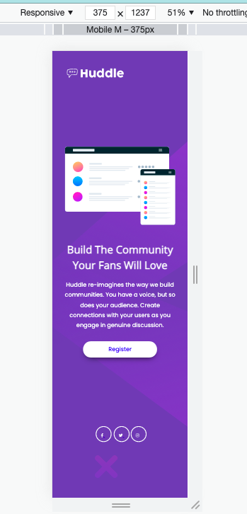
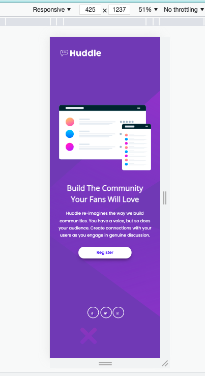
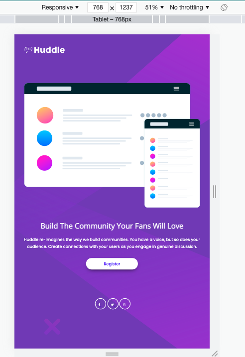
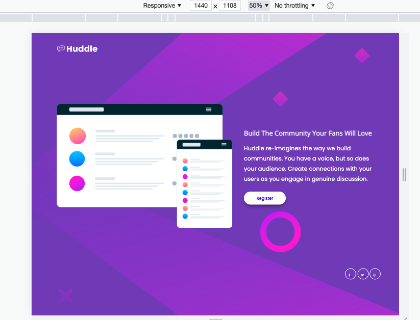

# Frontend Mentor - Huddle landing page with single introductory section solution

This is a solution to the [Huddle landing page with single introductory section challenge on Frontend Mentor](https://www.frontendmentor.io/challenges/huddle-landing-page-with-a-single-introductory-section-B_2Wvxgi0). Frontend Mentor challenges help you improve your coding skills by building realistic projects.

## Table of contents

- [Overview](#overview)
  - [The challenge](#the-challenge)
  - [Final Outcome](#final-outcome)
  - [Links](#links)
- [My process](#my-process)
  - [Built with](#built-with)
  - [What I learned](#what-i-learned)
- [Author](#author)

## Overview

### The challenge

Users should be able to:

- View the optimal layout for the page depending on their device's screen size
- See hover states for all interactive elements on the page

### Screenshot

### Final Outcome

Screen_Mobile_375  

Screen_LMobile_425  

Screen_Tablet_768  

Screen_LLaptop_1440  

### Links

- Solution URL: [Github Repo](https://github.com/archana-nagaraj/Frontend-Mentor-Huddle-Landing-Page_with-Single-Introductry-Section)
- Live Site URL: [Github Pages](https://archana-nagaraj.github.io/Frontend-Mentor-Huddle-Landing-Page_with-Single-Introductry-Section/)

## My process

### Built with

- Semantic HTML5 markup
- CSS custom properties
- Flexbox
- Mobile-first workflow

### What I learned

- practiced more of box-model, css properties

## Author

- Frontend Mentor - [@archana-nagaraj](https://www.frontendmentor.io/profile/archana-nagaraj)
- Github - [@archana-nagaraj](https://github.com/archana-nagaraj)
- Email - [archana.nagaraj](archana.nagaraj@gmail.com)

## Yet to Finish

- Work on media queries a bit more to match up to the design images.

**Had fun building!** 🚀
